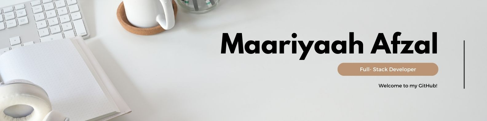

## Hi there, I'm Maariyaah!

I grew up in Lisbon, Portugal and moved to the UK 10 years ago where I  began my career in the insurance world in London. After achieving my goal of becoming a chartered insurance professional, I decided to pivoted towards the world of tech! I  completed Le Wagon's Web Development bootcamp with the drive to pursue a new career. I am now committed to leveraging this new skill set alongside my enthusiasm and curiosity to bring innovation to a new industry!

Skills:
[]

Connect with me on: 

https://github.com/Maariyaah/Maariyaah/blob/main/JavaScript-Logo.png

<!--
**Maariyaah/Maariyaah** is a ✨ _special_ ✨ repository because its `README.md` (this file) appears on your GitHub profile.

Here are some ideas to get you started:

- 🔭 I’m currently working on ...
- 🌱 I’m currently learning ...
- 👯 I’m looking to collaborate on ...
- 🤔 I’m looking for help with ...
- 💬 Ask me about ...
- 📫 How to reach me: ...
- 😄 Pronouns: ...
- ⚡ Fun fact: ...
-->
